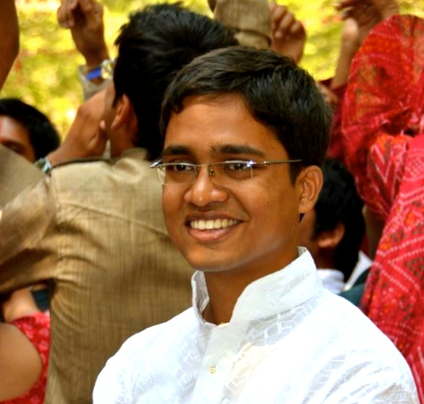

# Happy hunting for a Year old

Ruby has an amazing community. Abundantly thriving open-source projects depict this picture appropriately.
Yet a lot of help is needed by many of the projects. Some of these are used by thousands in production.
So if you have been in slumber for the last decade, or have been new to Ruby-like me, and are pumping to give back
to this amazing community, I will in this talk, walk you through my story of how I got into contributing in the
past year, and why should you too.

This talk centre's about current state of open-source ruby projects and how more people should be getting into giving
back to the community. Why contributing should matter to you and everyone else, how the many small contributions matter,
and how you can in simplest ways help out.

## My Name

Vipul is a Consultant at BigBinary, and has previously worked at Fab.com.
He is an avid Rails and Ruby Contributor.
His spare time is spent exploring and contributing to many Open Source ruby projects, when not dabbling with Clojure or Rubymotion.

- [My website](http://vipulnsward.com)
- [My twitter](https://twitter.com/vipulnsward)
- [Past talks] (http://lanyrd.com/profile/vipulnsward/past/speaking/)